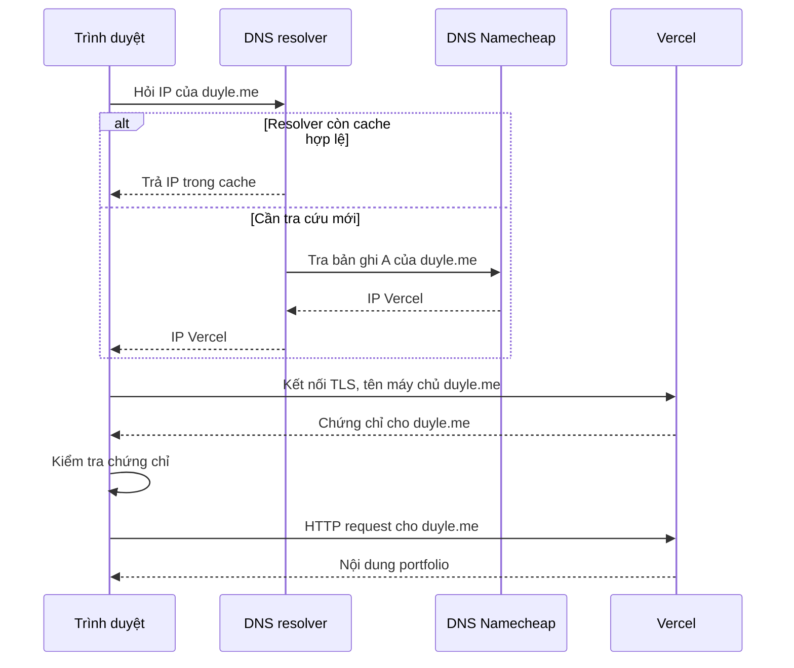

# duyle.me: DNS, Vercel và HTTPS

Ngày cấu hình: 2026-10-06, múi giờ Asia/Ho_Chi_Minh.

## Các thành phần

| Thành phần | Vai trò trong website này |
| --- | --- |
| GitHub | Lưu source code trong repo `leduy-it/duyle-portfolio`. GitHub Pages còn có một website riêng tên `leduy.js`. |
| Namecheap | Quản lý đăng ký `duyle.me` và các bản ghi DNS hiện tại. |
| DNS | Trả lời tên miền này trỏ đến địa chỉ IP nào. |
| Vercel | Phục vụ portfolio từ project `portfolio-leduy`. |
| TLS / HTTPS | Kiểm tra danh tính máy chủ theo tên miền và mã hóa kết nối. |

GitHub lưu code và GitHub Pages phục vụ website là hai chức năng riêng. Website có thể lấy code từ GitHub rồi chạy trên Vercel.

## Trình duyệt mở website như thế nào?



Sơ đồ rút gọn: trình duyệt và hệ điều hành cũng có thể giữ cache. Resolver có thể hỏi các máy chủ DNS root và `.me` để tìm DNS Namecheap khi chưa biết nơi quản lý domain. DNS không tải nội dung website; sau khi có IP, trình duyệt kết nối tới máy chủ web.

Vercel dùng tên miền trong kết nối TLS và HTTP request để chọn chứng chỉ và website phù hợp. Một địa chỉ IP của nền tảng có thể phục vụ nhiều website.

## Những bước đã thực hiện

### 1. Xác định project đang phục vụ portfolio

Kiểm tra remote repo và cấu hình project. Project chính xác là `portfolio-leduy`, trong scope `leduy-its-projects`.

Danh sách alias cho thấy `duyle.me` và `leduy.vercel.app` cùng trỏ tới deployment `portfolio-leduy-mnjzz9fy6-leduy-its-projects.vercel.app`. Đây là snapshot khi cấu hình domain; deployment có thể đổi trong những lần deploy sau.

### 2. Thêm tên miền vào Vercel

```bash
vercel domains add duyle.me portfolio-leduy
vercel domains add www.duyle.me portfolio-leduy
```

Thao tác này cho Vercel biết project nào nhận request của từng tên miền. Cấu hình phía Namecheap vẫn cần cập nhật riêng.

### 3. Đổi địa chỉ trong DNS Namecheap

Ban đầu bốn bản ghi A của `@` trỏ tới GitHub Pages:

```text
185.199.108.153
185.199.109.153
185.199.110.153
185.199.111.153
```

Owner đã thay chúng bằng hai bản ghi do Vercel đề xuất cho domain này:

| Type | Host | Value |
| --- | --- | --- |
| A | `@` | `216.198.79.1` |
| A | `@` | `64.29.17.1` |

`@` biểu thị domain gốc `duyle.me`. Bản ghi hiện có `CNAME www → duyle.me` khiến việc tra `www.duyle.me` tiếp tục tra IP của `duyle.me`.

Nameserver vẫn là `dns1.registrar-servers.com` và `dns2.registrar-servers.com`: DNS tiếp tục được quản lý tại Namecheap. Các bản ghi email MX/TXT không cần thay đổi cho việc chuyển website.

Các IP trên là giá trị đã được Vercel đề xuất khi cấu hình domain này. Khi cấu hình một project khác hoặc trong tương lai, lấy giá trị được đề xuất hiện tại.

### 4. Xác minh DNS và yêu cầu cấp chứng chỉ HTTPS

```bash
vercel domains verify duyle.me
vercel certs issue duyle.me
vercel certs issue www.duyle.me
```

Vercel xác nhận DNS domain gốc hợp lệ và trả về thông báo tạo chứng chỉ thành công cho cả hai tên miền. Vercel quản lý HTTPS, thông thường tự cấp và gia hạn chứng chỉ cho domain cấu hình đúng; trong phiên này đã chủ động gọi lệnh cấp chứng chỉ.

Chứng chỉ cần khớp tên miền người dùng mở. Chứng chỉ `*.github.io` không xác thực được `duyle.me`.

### 5. Kiểm tra kết quả thực tế

Ở lần kiểm tra trong phiên này:

- Google DNS và Cloudflare DNS đều trả hai IP Vercel mới cho `duyle.me`.
- Request HTTPS có kiểm tra chứng chỉ tới `duyle.me` và `www.duyle.me` đều trả HTTP 200, tiêu đề portfolio `Michael Le — AI Engineer, OCR & agents`.
- Mở `https://duyle.me/` bằng Chrome trên máy đang kết nối với phiên làm việc hiển thị đúng portfolio.
- Một thiết bị khác của owner vẫn nhận chứng chỉ `*.github.io` hoặc trang `leduy.js / leduy-it.github.io`. Lỗi trên thiết bị đó chưa được xác nhận hết.

## Vì sao thiết bị khác còn vào GitHub?

Các dấu hiệu trên chứng minh thiết bị đó còn kết nối tới GitHub. Khả năng cao một lớp cache DNS vẫn giữ IP cũ; cần kiểm tra resolver của thiết bị hoặc mạng để xác định chính xác lớp nào.

DNS có TTL: thời gian được phép giữ câu trả lời trong cache. Namecheap mặc định dùng TTL 1800 giây, tức 30 phút. TTL giảm theo thời gian trong từng cache; các thiết bị có thể nhận kết quả mới vào những thời điểm khác nhau. Không thể xóa cache của mọi người từ Vercel.

### Cách chẩn đoán trên thiết bị bị lỗi

1. Thử mở `https://duyle.me/` qua mạng di động hoặc hotspot khác. Nếu mạng khác mở được, kiểm tra DNS của mạng ban đầu.
2. Đóng hoàn toàn trình duyệt, mở lại sau khi làm mới DNS của hệ điều hành.
3. Trên Windows, mở Command Prompt và chạy:

   ```cmd
   ipconfig /flushdns
   nslookup duyle.me
   ```

   Câu trả lời A mong đợi là hai IP Vercel ở trên. `nslookup` kiểm tra DNS và không đại diện cho mọi cache riêng của trình duyệt.
4. Nếu resolver của mạng còn trả IP GitHub, chờ TTL hết hoặc dùng mạng/resolver khác. Xóa cache trên máy không xóa cache của nhà mạng.
5. Khi chứng chỉ vẫn là `*.github.io`, không bỏ qua cảnh báo để vào website.

## Tự kiểm tra phía Vercel trong tương lai

Chạy trong checkout đã link với project hoặc thêm scope phù hợp:

```bash
vercel domains verify duyle.me
vercel domains verify www.duyle.me
vercel alias ls
```

Kiểm tra ba lớp riêng biệt: **DNS trỏ đúng IP → Vercel gắn domain vào đúng project → HTTPS có chứng chỉ hợp lệ**. Sau đó mới kiểm tra nội dung website và lỗi của ứng dụng.

## Tài liệu gốc

- [Cloudflare: DNS hoạt động như thế nào](https://www.cloudflare.com/learning/dns/what-is-dns/)
- [Namecheap: cấu hình bản ghi DNS và TTL](https://www.namecheap.com/support/knowledgebase/article.aspx/434/2237/how-do-i-set-up-host-records-for-a-domain/)
- [Vercel: thêm custom domain](https://vercel.com/docs/domains/working-with-domains/add-a-domain)
- [Vercel: chứng chỉ SSL](https://vercel.com/docs/domains/working-with-ssl)
- [Microsoft: ipconfig và flushdns](https://learn.microsoft.com/en-us/windows-server/administration/windows-commands/ipconfig)
